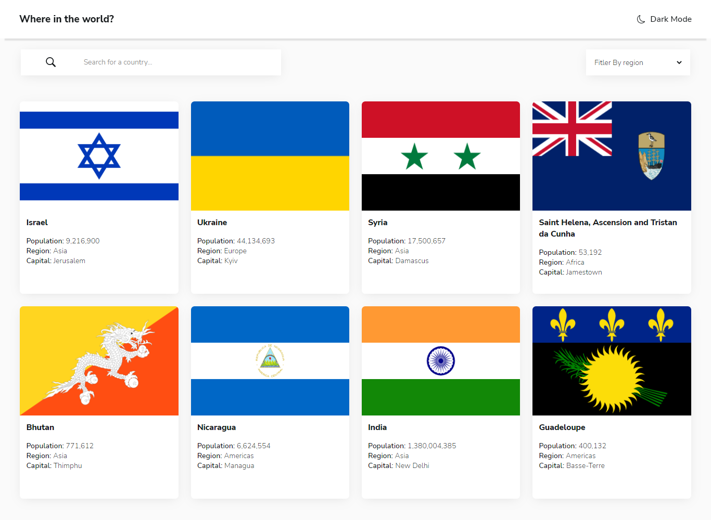
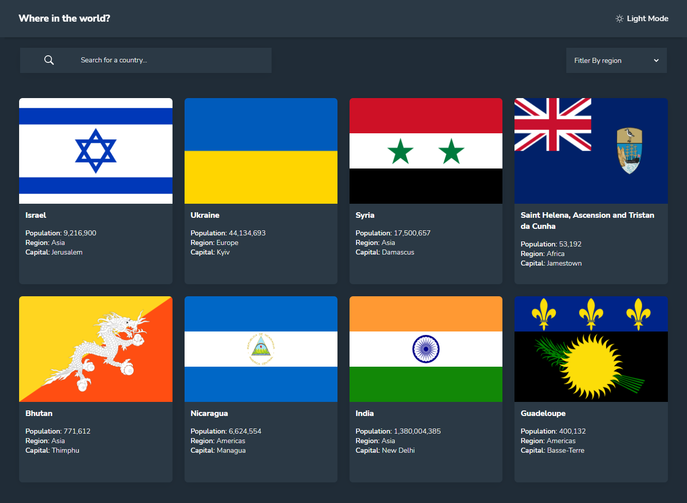

# Frontend Mentor - REST Countries API with color theme switcher solution

This is a solution to the [REST Countries API with color theme switcher challenge on Frontend Mentor](https://www.frontendmentor.io/challenges/rest-countries-api-with-color-theme-switcher-5cacc469fec04111f7b848ca). Frontend Mentor challenges help you improve your coding skills by building realistic projects.

## Table of contents

- [Frontend Mentor - REST Countries API with color theme switcher solution](#frontend-mentor---rest-countries-api-with-color-theme-switcher-solution)
  - [Table of contents](#table-of-contents)
  - [Overview](#overview)
    - [The challenge](#the-challenge)
    - [Screenshot](#screenshot)
    - [Links](#links)
  - [My process](#my-process)
    - [Built with](#built-with)
    - [Continued development](#continued-development)
    - [Useful resources](#useful-resources)
  - [Author](#author)
  - [Acknowledgments](#acknowledgments)

**Note: Delete this note and update the table of contents based on what sections you keep.**

## Overview

### The challenge

Users should be able to:

- See all countries from the API on the homepage
- Search for a country using an `input` field
- Filter countries by region
- Click on a country to see more detailed information on a separate page
- Click through to the border countries on the detail page
- Toggle the color scheme between light and dark mode _(optional)_

### Screenshot

### Links

- Solution URL: [My Solution](https://github.com/Multimarix/rest-countries-with-ts)
- Live Site URL: [Live Site](https://countries-react-ts.netlify.app/)

## My process

### Built with

- Semantic HTML5 markup
- CSS custom properties
- Flexbox
- CSS Grid
- Mobile-first workflow
- [React](https://reactjs.org/) - JS library
- [Typescript](https://www.typescriptlang.org/) - Typescript
- [Styled Components](https://styled-components.com/) - For styles
- [React Skeleton Loader](https://www.npmjs.com/package/react-loading-skeleton) - For skeleton loaders in-app
- [Rest Countries API](https://restcountries.com/) - For Countries Data

### Continued development

I plan to work on another version of this app that uses a different approach when it comes to the data fetching. I will leverage the full power of React Router v6.4 in that version.

### Useful resources

- [Organizing Typescript Code](https://blog.logrocket.com/organizing-typescript-code-using-namespaces/) - This helped during development to organize my typescript code.
- [User-Defined Type Guards](https://levelup.gitconnected.com/user-defined-type-guards-in-typescript-fad639e4944f) - This is a good article about user defined type guards in typescript. It helped me a lot.

## Author

- Github - [Di-void](https://github.com/Di-void)
- Frontend Mentor - [@Multimarix](https://www.frontendmentor.io/profile/Multimarix)
- LinkedIN - [Don Akhirebhulu](https://www.linkedin.com/in/don-akhirebhulu-675082242/)

## Acknowledgments

Very tasking project from Frontend Mentor. Hats off to whoever came up with the designs.
